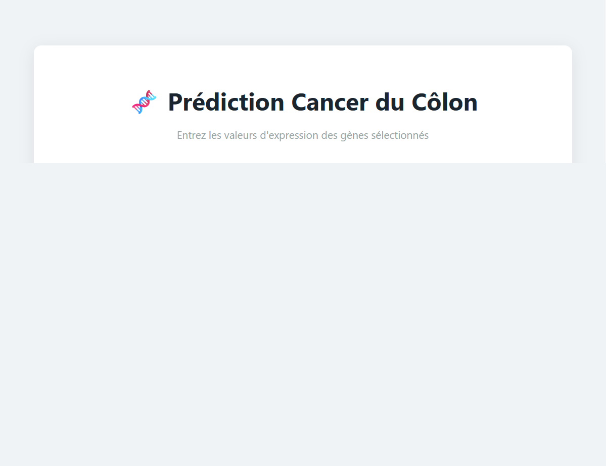

# Colon Cancer Machine Learning App

This project is a full-stack proof-of-concept for predicting colon cancer status using gene expression data.

## Features

- FastAPI backend serving prediction and gene selection endpoints
- Frontend static interface for entering gene values and showing predictions
- Training pipeline that selects top genes and saves a logistic regression model
- Docker Compose setup for running training and app services

## Run locally

1. Install dependencies:

```bash
cd c:\Users\one\Desktop\s2\Methodologie\colon-cancer-ml\app
python -m pip install -r requirements.txt
cd ..\training
python -m pip install -r requirements.txt
```

2. Start the app:

```bash
cd c:\Users\one\Desktop\s2\Methodologie\colon-cancer-ml\app
python -m uvicorn backend.main:app --host 0.0.0.0 --port 8000
```

3. Open the frontend:

- `http://127.0.0.1:8000/frontend/index.html`

## API Endpoints

- `GET /health` - health check
- `GET /genes` - returns selected gene list
- `POST /predict` - request body is a JSON object with gene values

Example payload for `/predict`:

```json
{
  "X12466": 1.23,
  "T89730": 4.56,
  "0": 7.89,
  "H55933": 0.12,
  "R39465": 3.45,
  "R85482": 6.78
}
```

## Screenshot



## Notes

- The backend now serves the frontend at `/frontend/index.html`.
- The model and scaler are loaded from `model/`.
- If you want to save the model artifacts separately, keep `model/` in git or exclude it if you prefer not to track binary files.
